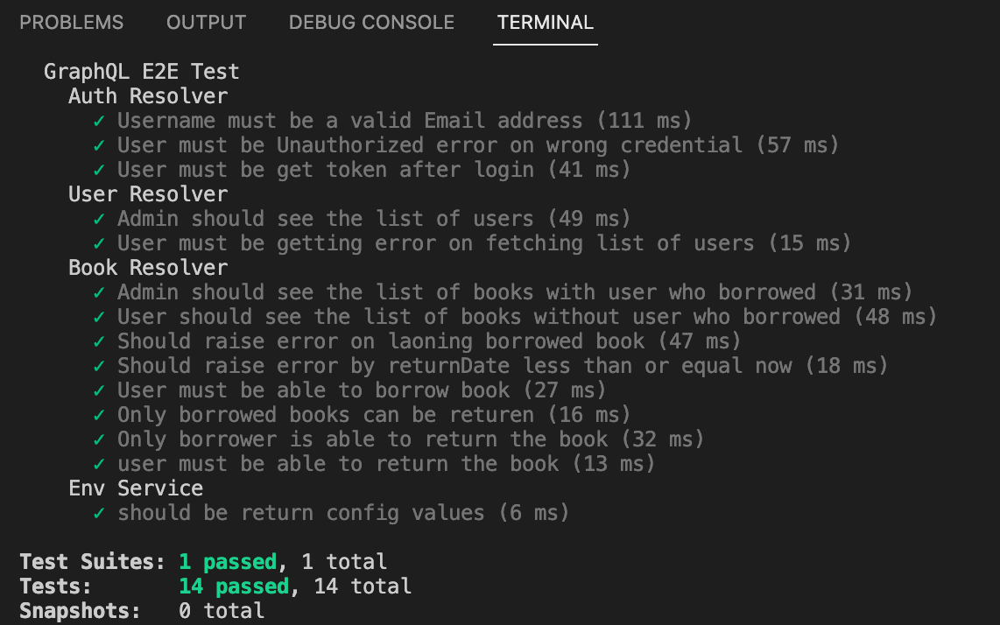

# Library API

This application developed for test purpose only via below technologies:

- [ ] NestJS
- [ ] GraphQL
- [ ] MongoDB
- [ ] Docker

There is two type of users

- [ ] **Admin**: Can view list of users and list of books plus users who borrowed them
  - Username: admin@demo.com
  - password: admin
- [ ] **User**: Can view list of books, loaning and returning them

  - Username: user1@demo.com
  - password: user1

  - Username: user2@demo.com
  - password: user2

**Models will be filled by seeding module**

## Getting started

After clone, there are two ways to run this application:

### Docker-Compose

In order to start this application using docker compose:

```
cd library-api
docker-compose up -d --build
browse http://localhost:3000/graphql
```

### Locally

In order to start this application locally, **make sure that you have already installed mongodb** on your system:

```
cd library-api
yarn
yarn test
yarn seed
yarn start
browse http://localhost:3000/graphql
```

## Config files

Config files placed at **src/env/configs**

- [ ] local.yaml
- [ ] docker.yaml

## How it works

First of all, In order to work with the system, you need to login:

```
mutation {
  login(username:"admin@demo.com",password:"admin")
}
```

OR

```
mutation {
  login(username:"user1@demo.com",password:"user1")
}
```

By this, token will be generated. This token must be provided for the rest of Queries/Mutations in **HTTP HEADERS**

```
{
  "Authorization": "Bearer token"
}
```

_Don't forget to replace token!_

**List of users**

```
query {
  usersList {
    users {
      _id
      username
      role
    }
  }
}
```

**List of books**

```
query {
  booksList {
    books {
      _id
      title
      Author
      loaned
      loanedBy {
        _id
        username
      }
      loanedDate
      returnDate
    }
  }
}
```

**Loan book**

```
loanBook(bookId: ObjectId!, returnDate: Date!): Boolean
```

_Date is a custom scalar. To generate that you can use e.g. new Date(2022, 8,19).getTime()_

**Return book**

```
returnBook(bookId: ObjectId!): Boolean
```

## E2E testing

In order to run test locally, MongoDB must be installed. This application will make test database and run End to End testing.

```
yarn test
```


